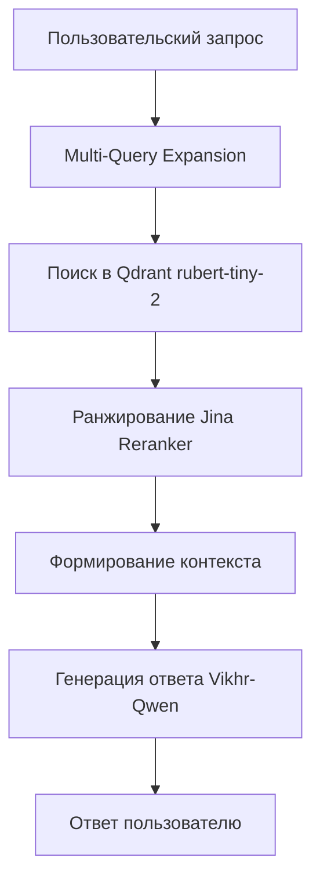

## RAG-система для русской Википедии

Этот проект реализует RAG-систему (Retrieval-Augmented Generation) для работы с русскоязычным контентом Википедии, используя NLP-модели и техники улучшения качества ответов.

[`Ссылка на kaggle`](https://www.kaggle.com/code/mrtimax/notebookd7bcd1f13e)
  

### Ключевые компоненты системы
- **LLM**: [`Vikhrmodels/Vikhr-Qwen-2.5-1.5B-Instruct`](https://huggingface.co/Vikhrmodels/Vikhr-Qwen-2.5-1.5B-Instruct) (1.5B параметров, оптимизирован для инструкций на русском)
- **Эмбеддинг-модель**: [`rubert-tiny-2`](https://huggingface.co/cointegrated/rubert-tiny-2) (компактная модель для векторизации текста)
- **Реранкер**: [`jinaai/jina-reranker-v2-base-multilingual`](https://huggingface.co/jinaai/jina-reranker-v2-base-multilingual) (улучшение релевантности результатов)
- **Векторная БД**: Qdrant (с косинусной метрикой расстояния)
- **Поисковые улучшения**: Multi-Query Retrieval, Reranking
- **Параметры генерации**:
  ```python
  {
    "max_new_tokens": 256,
    "do_sample": True,
    "temperature": 0.7,    # Баланс креативности
    "top_p": 0.8            # Контроль разнообразия
  }
  ```

### Особенности реализации
1. **Улучшенный поиск через Multi-Query**:
   - Генерация нескольких вариаций запроса
   - Агрегация результатов из разных перспектив
   - Улучшение покрытия темы

2. **Двухэтапный реранкинг**:
   - Первичный поиск по эмбеддингам (rubert-tiny-2)
   - Точная переранжировка топ-результатов с помощью Jina Reranker
   - Увеличение точности финального контекста

3. **Оптимизированная генерация**:
   - Специализированная легкая русскоязычная модель Vikhr-Qwen
   - Сбалансированные параметры генерации
   - Ограничение длины ответов для релевантности

4. **Строгий промпт**:
       **Системная инструкция (System Prompt):**
 ```python
  Ты — AI-ассистент, отвечающий ТОЛЬКО на основе предоставленного контекста из русскоязычной Википедии. Строго соблюдай правила:
  1.  **Контекст — основной вспомогательный источник:** Ответ должен точно соответствовать информации из фрагментов контекста.
  2.  **Краткость и ясность:** Отвечай максимально коротко !!!не больше 5 слов!!!, по сути вопроса, без вводных фраз.
  3.  **Честность при отсутствии ответа:** Если в контексте НЕТ информации для ответа, скажи "Не знаю" или "В предоставленном контексте
  нет информации об этом". ЗАПРЕЩЕНО придумывать, додумывать или давать ответы не из контекста.
  4.  **Точность:** Сохраняй факты, цифры, имена и термины из контекста без изменений.
  **Контекст (Context):**
  {context}  
  
  **Вопрос пользователя (User Question):**
  {query}
  
  **Твой ответ (AI Response):**
  [Начни ответ сразу по существу, без преамбул]
 ```
5. **Оценка качества**:
   В качестве оценивающих метрик были выбраны perplexity + BLEU, их значения покажут насколько модель уверенно отвечает, и насколь ответы отличаются от эталонного.
   Также дополнительно самостоятельно ответы проверялись на основе случайного семпла данных - 100 вопросов/ответов из исходного датасета.  

### Архитектура системы


### Результаты:

1. Низкий BLEU при низком Perplexity.
2. Конфликт с промптом:
3. Эталонные ответы в данных: короткие (1-2 слова).
4. Несмотря на строгий промпт (!не больше 5 слов!), модель часто генерирует более развернутые ответы (помимо случаев выдумываний).
5. Причина низкого BLEU: Разница в стиле ответа (модель дает чуть больше контекста/слов, чем эталон) сильнее влияет на BLEU, чем абсолютная правильность факта.
6. При этом проверяя ответы вручную на примере выборки из 100 случайных экземпляров RAG лишь иногда отвечает неверно.

### Примеры:

**Верные**:


**Неверные**:  


### Возможные улучшения
1. fine-tuning Vikhr-Qwen на датасете с краткими ответами из Википедии
2. Выбор более «умной» модели для RAG
3. Сжатие контекста (суммаризация из чанков)
4. Hyde (Hypothetical Document Embeddings) - его суть в том, чтобы до того, как проводить поиск релевантных документов, по запросу генерировать гипотетический, необязательно достоверный документ, который похож на потенциальный ответ. А уже затем на основе сгенерированного документа проводится отбор релевантных текстов.Иначе говоря, даже не слишком корректный документ может быть более репрезентативным и близким к данным, которые мы хотим выделить из БД и положить в контекст модели.


Для вопрос, пишите в tg @mrtimax
